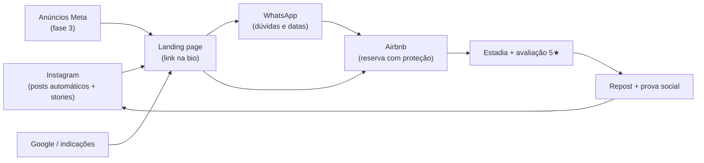

# 📣 Protocolo de divulgação e captura de hóspedes

Plano de marketing completo desta hospedagem. A automação cuida da constância;
este documento diz **o que fazer, quando e como** para transformar alcance em reservas.

## O funil (como um estranho vira hóspede)

Regra de ouro do funil: **feche as reservas pelo Airbnb** (proteção, avaliações e
ranking). O WhatsApp serve para atender rápido, tirar dúvidas e criar vínculo —
não para negociar por fora: além do risco de golpe e de punição da plataforma,
cada reserva no Airbnb melhora seu ranking e gera avaliação pública.

---

## Fase 0 — Consertar o que está travando a DomoBlua hoje ⚠️

Antes de investir energia em divulgação, resolva estes pontos. Eles vieram das suas
**2 avaliações reais** e dos dados do próprio anúncio — e hoje são o maior limitador.

| Problema | Evidência | O que fazer |
|---|---|---|
| **Mato alto na chegada** | Avaliação de fev/2026: *"chegamos à noite com 1 criança e um bebê e quase não achamos a entrada devido ao mato alto (...) no dia seguinte pegamos a enxada"* | Roçada agendada **antes de cada check-in**. Foi o motivo explícito de não dar 5 estrelas. |
| **Entrada difícil de achar à noite** | mesma avaliação | Placa refletiva com o nome DomoBlua no portão + luz de sensor + **guia de chegada com fotos** (você já começou o mapa de 800 m da GO-239 — finalize e mande sempre 24h antes). |
| **Taxa de resposta 80% / "responde em até um dia"** | painel do anúncio | Meta: **100% e < 1h**. Ative notificações do app. Isso pesa no ranking do Airbnb e é o fator nº 1 de conversão. |
| **Só 2 avaliações · nota 4,5** | o Airbnb nem exibe média antes de 3 | Prioridade absoluta: **chegar a 3-5 avaliações**. Veja a estratégia de lançamento abaixo. |
| **Sem cama "de verdade" no térreo** | avaliação do Ronald | Se couber no orçamento, uma cama box no térreo resolve a crítica mais repetida e sobe a nota. |
| **Detectores "não informados"** | seção Segurança do anúncio | Instale e **marque no anúncio** fumaça + monóxido: aparece como selo de segurança. |
| **Check-in 15h / checkout 15h** | Regras da casa | Parece erro de cadastro. Corrija o checkout (ex.: 11h ou 12h) para dar tempo de limpeza. |
| **"30 m do Poço do Motor"** | o resumo do anúncio diz 30 m e a descrição longa diz 300 m — a contradição está dentro do próprio anúncio | Meça e padronize. Distância errada gera frustração e avaliação ruim. |

### Estratégia de lançamento para sair de 2 → 5 avaliações (30-45 dias)
1. Baixe a diária ~15% e ative **desconto semanal** e **desconto para novo anúncio**.
2. Ative **Reserva instantânea** (melhora ranking).
3. Foque em **meio de semana**: preço agressivo enche datas ociosas e gera avaliação.
4. Após cada estadia, mensagem em até 24h: agradeça, pergunte se faltou algo e peça
   a avaliação. Nota alta cedo vale mais que diária alta cedo.

## Fase 1 — Fundação (semana 1)

Checklist de `CONFIGURACAO-OBRIGATORIA.md` + estes ajustes no anúncio:

1. **Fotos**: 20+, começando pelo deck panorâmico (é o seu maior diferencial visual).
   Inclua pessoas usando os espaços — foto com vida converte mais que imóvel vazio.
   Fotografe o Ribeirão dos Padres e o Poço do Motor: é o que ninguém mais tem.
2. **Título já é bom** ("Casa com Rio Privativo+Deck Panorâmico na Chapada").
   Teste variações citando **Colinas do Sul** e **pet friendly** — dois filtros de busca.
3. **Público certo**: grupos de 8-10, famílias grandes e **retiros** (yoga, bem-estar).
   O deck e a casa inteira para 10 pessoas são feitos para isso — inclua "retiro" no texto.
4. **Google Business Profile** (google.com/business): perfil gratuito com fotos, link da
   landing e WhatsApp — captura a busca "hospedagem em Colinas do Sul".

## Fase 2 — Tração (semanas 2 a 6)

### O que a automação já faz por você
- 4 posts/semana (seg/qua/sex 17h30 + sáb 10h) alternando: fatos do cerrado,
  atrativos da Chapada dos Veadeiros, dicas de ecoturismo, cachoeiras e promoção.
- Prioriza fotos reais que você deixar em `instagram/media/`.
- Landing sempre no ar recebendo cliques da bio.

### Sua rotina — 10 min/dia + 30 min/sábado

**Diário (10 min, de preferência 1h após o post):**
- Responda TODOS os comentários e DMs (o algoritmo premia conversa).
- Responda leads de WhatsApp/formulário em **menos de 15 minutos** quando possível —
  velocidade de resposta é o fator nº 1 de conversão de lead em reserva.

**3x por semana — Stories manuais (5 min cada):**
- Terça: enquete ("Time seca ou time águas?" / "Qual cachoeira você iria primeiro?").
- Quinta: bastidor real (arrumando o quarto, colhendo fruta, chuva no telhado).
- Domingo: repost do post do sábado + caixinha de perguntas.

**Sábado (30 min):**
- Interaja 15 min com a "vizinhança digital": comente (com conteúdo, não "lindo!👏")
  em posts de perfis de turismo da região, guias locais e hashtags
  #chapadadosveadeiros #cerrado #ecoturismo.
- Confira calendário e preços no Airbnb (feriado chegando? ajuste!).
- Suba 2-3 fotos novas em `instagram/media/` se tiver.

### Hashtags e localização
- O robô já inclui hashtags otimizadas por tema. Nos stories e posts manuais, use
  5-10: misture grandes (#ecoturismo), médias (#chapadadosveadeiros) e locais
  (#altoparaisodegoias, #cavalcantegoias, a cidade da hospedagem).
- **Sempre marque a localização** nos posts e stories — busca local traz hóspede.

### Parcerias (a alavanca mais subestimada)
1. **Guias e condutores locais**: combine indicação mútua (você indica o passeio,
   eles indicam a hospedagem). Feche 2-3 parcerias já na fase 2.
2. **Perfis regionais de turismo**: envie suas melhores fotos oferecendo repost
   com crédito — alcance gratuito e qualificado.
3. **Microcriadores de conteúdo** (5k-50k seguidores de viagem): ofereça 1-2 diárias
   em baixa ocupação em troca de stories + reels + fotos com direito de uso.
   Priorize quem tem audiência em Goiás/DF/SP.
4. **Grupos de Facebook/WhatsApp de viagem**: NÃO faça spam. Entre, ajude, responda
   dúvidas sobre a região; quando alguém pedir indicação de hospedagem, aí sim
   apresente a sua com o link.

### Script de atendimento de lead (WhatsApp)

> Oi, [nome]! Que bom que você chamou 😊
> Para [datas], temos disponibilidade sim! Fica em R$ [valor] as [n] noites para
> [n] pessoas, já com tudo incluído.
> A reserva é feita pelo Airbnb (link abaixo), com pagamento protegido e podendo
> parcelar: [link]
> E quando fechar, te mando nosso mini-roteiro da região com as cachoeiras
> certas para o seu estilo. Posso te ajudar a montar as datas?

Se não houver disponibilidade: **sempre** ofereça datas alternativas + peça para
avisar da próxima vez ("posso te avisar quando abrir vaga em feriado?").

### Pós-estadia (gera a próxima reserva)
1. No checkout, mensagem de agradecimento + pedido de avaliação no Airbnb.
2. Peça 2-3 fotos que o hóspede tirou → poste como prova social (com crédito).
3. Copie as melhores avaliações para o `CONFIG.depoimentos` da landing.

## Fase 3 — Escala (a partir do mês 2)

Comece quando: landing com fotos reais + 5 avaliações no Airbnb + Pixel instalado.

1. **Meta Ads — campanha de tráfego** (Gerenciador de Anúncios):
   - Objetivo: tráfego para a landing (ou mensagens no WhatsApp).
   - Público: 25-55 anos, interesses *ecoturismo, trilha, cachoeira, Airbnb, viagem*,
     morando em Brasília/Goiânia/São Paulo (ajuste à distância real do seu público).
   - Orçamento: **R$ 10-20/dia por 2 semanas**, depois avalie.
   - Criativo: use o post automático de melhor desempenho (é só impulsionar).
2. **Remarketing**: com o Pixel na landing, crie público "visitou a página nos
   últimos 30 dias" e anuncie a oferta/datas — é o anúncio mais barato que existe.
3. **Oferta de ocupação**: semana fraca no calendário? Story + post relâmpago
   "meio de semana com X% off" impulsionado por R$ 30-50 para o público de remarketing.

## Calendário sazonal do cerrado (planeje 60-90 dias antes)

| Época | O que acontece | Campanha |
|---|---|---|
| Mai–Set (seca) | Águas cristalinas, trilhas secas, céu estrelado, ipês (ago-set) | "Alta temporada de cachoeira" — reserve cedo |
| Jun–Jul (férias/festas juninas) | Alta procura | Pacotes de 3+ noites, antecedência |
| Out–Abr (águas) | Verde total, cachoeiras cheias | "Cerrado verde" — preços atrativos meio de semana |
| Feriados nacionais | Pico de busca ~60 dias antes | Posts de urgência + ads 45-60 dias antes |
| Baixa ocupação pontual | Vagas ociosas | Oferta relâmpago stories + remarketing |

## KPIs — acompanhe toda segunda (10 min)

| Métrica | Onde ver | Meta inicial |
|---|---|---|
| Visitas na landing | GA4 | 100/semana no mês 2 |
| Cliques WhatsApp + leads formulário | GA4 / e-mail | 5-10/semana |
| Taxa lead → reserva | anotação própria | > 20% |
| Alcance e seguidores IG | Insights do Instagram | crescimento constante > quantidade |
| Visualizações do anúncio | Painel do Airbnb | subir semana a semana |
| Ocupação do mês seguinte | Calendário Airbnb | 50%+ no mês 3 |

Se visitas altas e poucos leads → problema na landing (fotos/preço).
Se leads altos e poucas reservas → problema no atendimento (velocidade/script).
Se tudo baixo → aumentar topo de funil (parcerias + ads).

## Regras de ouro

1. **Nunca compre seguidores/engajamento** — mata o alcance da conta.
2. Fotos sempre reais (a decepção vira avaliação ruim).
3. LGPD: use os contatos do lead só para responder — nada de listas de transmissão
   sem consentimento explícito.
4. Responda TODAS as avaliações do Airbnb, boas ou ruins, com educação e solução.
5. Constância vence intensidade: a automação garante o mínimo; seus stories e
   respostas fazem a diferença.
